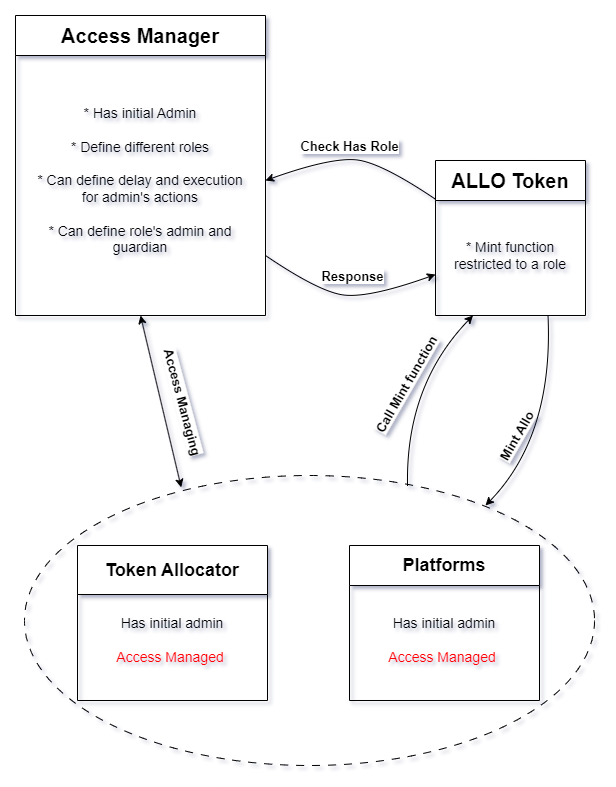

# Allostasis Tokenomics
Based on the Allostasis tokenomic document, this tokenomic requires a rich access manager for minting tokens, releasing, staking, and so on. For managing these accesses, Allostasis takes advantage of AccessManager library introduced by OpenZeppelin.  
The AccessManager manages roles across any number of contracts. It is a contract that can be deployed and used out of the box. It sets an initial admin in the constructor who will be allowed to perform management operations. 
In order to restrict access to some functions of your contract, you should inherit from the AccessManaged contract provided along with the manager. This provides the restricted modifier that can be used to protect any externally facing function. Note that you will have to specify the address of the AccessManager instance (initialAuthority) in the constructor do the restricted modifier knows which manager to use for checking permissions.

The main smart contracts implemented for this purpose are as follows: 

  • <strong> Token Contract :</strong> 
    This is an ERC20 contract that is pausable and inherits from the AccessManager library.  
    The IERC20 provided by OpenZeppelin does not support the "mint" function in its interface, Since the ALLO token is minable and only 4 contracts have access to call it, for providing the access to "mint" function, Allostasis dose not use OpenZeppelin's IERC20. Contracts that requiring access to this function must use the interface related to the ALLO Token. 

  • <strong> TokenomicManager Contract: </strong> 
    This contract inherits from AccessManager and is responsible for defining and managing access to the functions of its supported contracts. 
    
These two contracts, ALLO Token and TokenomicManager, are the foundational contracts for Allostasis' tokenomic system. Additionally, based on the charts provided in the Allostasis documents, two other contracts are presented as the second layer of Tokenomic. These contracts are as follow:
  
  • <strong> TokenAllocator:</strong>  
    A total of two billion Allo tokens will be minted and allocated to three primary areas: Treasury, Content, and Development, distributed over ten stages with specific locking conditions. The Allostasis admin will facilitate the transfer of these tokens to respective wallet addresses by executing the txReward() function.

  

  
  

    • Treasury: Out of the total allocation, one billion Allo tokens are designated for the Treasury, which will remain locked until the ecosystem reaches a significant milestone of 1.2 million users. Once this target is met, a DAO (Decentralized Autonomous Organization) will conduct voting sessions to determine the use of these treasury funds.  
     • Content: For the Content segment, 500 million Allo tokens have been earmarked for distribution among creators, Nodes, and content viewers, with allocations based on a decentralized assessment of each party's influence and impact on knowledge sharing within the community. 
     • Development: 500 million Allo tokens are allocated for Development, aimed at enhancing the Allostasis infrastructure, which encompasses critical components such as smart contracts, Nodes, a Social Network, Collaboration Servers, Storage solutions, and AI engines. This strategic distribution is designed to foster growth and sustainability within the ecosystem.
    

 • <strong> Platforms:</strong>  

  To help platforms grow and their communities thrive, the Allostasis DAO foundation has reserved 500 million Allo tokens. These tokens motivate users to get involved in the growing platform.

## Introduction

Welcome to the documentation for the token economy contracts of Allostasis. This repository contains the smart contracts that power the tokenomics of Allostasis. These contracts are designed to manage token distribution, staking, rewards, and other related aspects across various sections and parts. 

  

Access in all mentioned contracts is managed by the TokenomicManager, and the flow of communication between these contracts and the central management and token is as follows: 
When a contract wants to call any functions that is restricted with TokenomicManager, after the caller initializes the call, the receiver contract checks the caller's access with TokenomicManager. If the verification is successful, the receiver contract runs the function; otherwise, the transaction will revert with an "access denied" message. 
This flow ensures that access control is centralized and managed by the TokenomicManager across all mentioned contracts. 

  

It is worth mentioning these contracts are at the same access level, and only these have access to mint tokens. Minting Outside of their logic is not possible. 
Based on the diagram provided, these contracts inherit from AccessManager and hold the TokenomicsManager address as the initialAuthority. When one of these contracts requests to mint tokens, the request is forwarded to the ALLO Token contract. However, this contract does not mint the tokens instantly. Instead, first ALLO contract verifies the sender's address and the requested function (in this case, mint) with the TokenomicsManager. If the response is positive, the requested amount of tokens is minted and transferred to the requester's address. This flow will be implemented for token minting in all four contracts of the second layer of the Allostasis tokenomic system. 

For example the TokenAlllocator contract wants to mint amount of ALLO tokens,  
  → The TokenAlllocator contract "Calls Mint function" and wait for the token, 
  → The ALLO token "Checks Has Role" with TokenomicsManager (Allostasis' Access Manager), 
  → After The TokenomicsManager's (Allostasis' Access Manager) "Response", 
The specified amount of tokens will be minted or the transaction will be reverted. 
 
## Token Distribution by TokenAllocator Smart Contract

The TokenAllocator smart contract is responsible for minting Allo tokens and distributing them to the Treasury, the Content Platform, and the Allostasis Infrastructure.
In this contract, the admin can set the relevant addresses using the `setAddress()` function. According to the stages defined in the Tokenomics white paper, a specific amount of Allo tokens will be allocated accordingly.
The admin must transition the system to the next stage using the `changeStage()` function and then transfer tokens to the designated recipients via the `txReward()` function.
Failure to do so will prevent the transition to the next stage.

In each stage, 10% of the rewards will be transferred to users' wallets from the Content Platform and the Allostasis Infrastructure, while the remaining 90% will be transferred to the ssAllo smart contract.
This smart contract is responsible for minting ERC721 tokens (ssAllo NFTs) for each user, representing 90% of their rewards. During this period, users can participate in DAO voting.
After two awarding stages, users can burn their ssAllo NFTs to claim their staked tokens, along with the platform's profits earned over the staking period.

Any remaining rewards from each stage will be sent to the Treasury.

### Key Functions

- **`setAddress()`**: This function allows the admin to specify the addresses of the Treasury, Content Platform, and Allostasis Infrastructure.

- **`changeStage()`**: This function allows the admin to change the current stage of token distribution. Each stage corresponds to different rules and allocations as defined in the Tokenomics white paper.

- **`txReward()`**: This function is used to transfer the allocated Allo tokens to the specified recipients. It ensures that the tokens are distributed according to the current stage's allocation plan. 
 

  

 

## License

The Allostasis Tokenomics project is licensed under the <strong>MIT License</strong>.